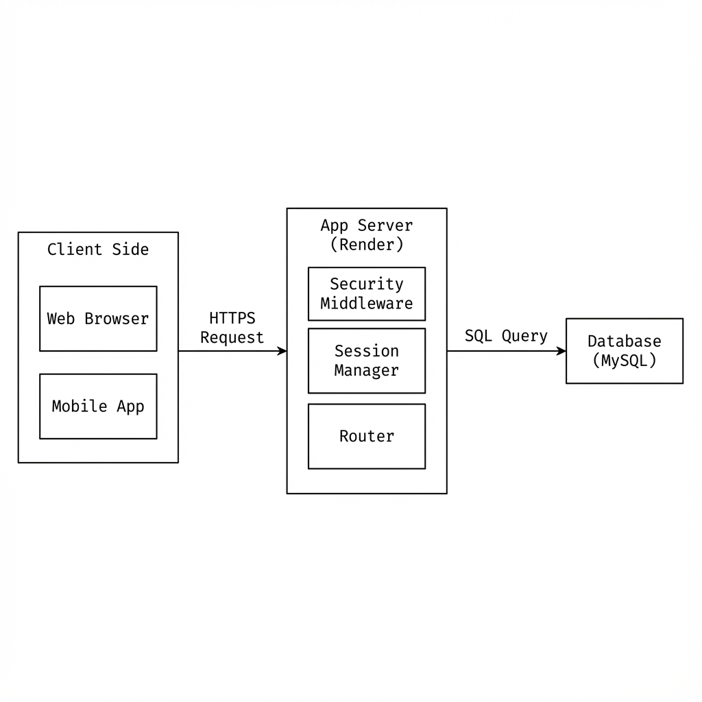
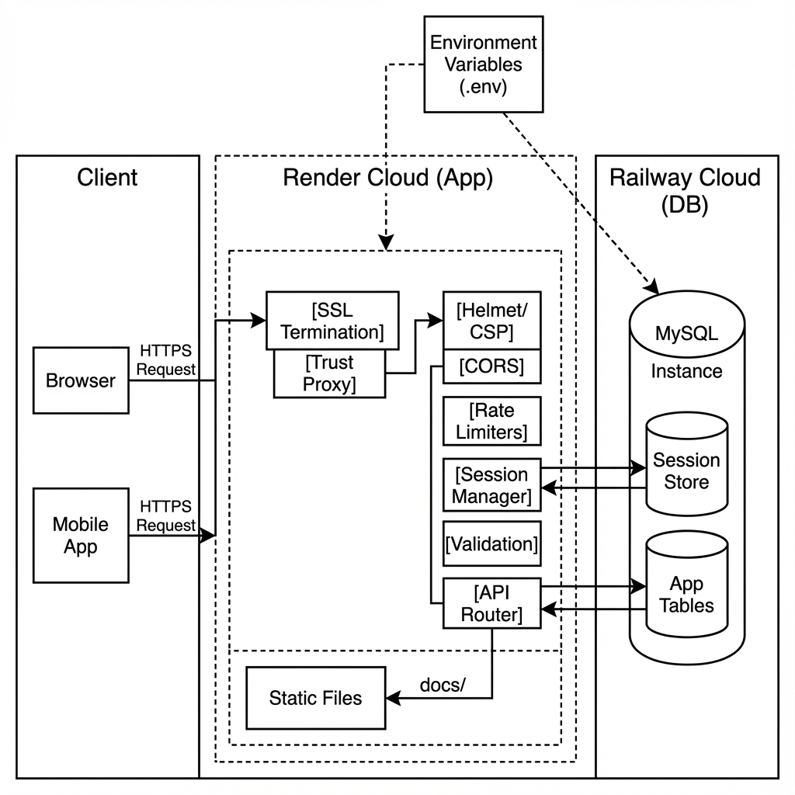

# Application Overview Report

## 1. Main Purpose of the Application
The main goal of this application is to connect donors, volunteers, and sponsors with the "Joy Home" children and old folks’ homes. It provides a convenient platform for them to find information and get involved. The web application aims to raise awareness by sharing updates and photos from the homes. It allows volunteers to easily book a time slot to help out, and it makes it simple for donors to give money or supplies.

## 2. Problem Description and Target Users

**2.1 Users or Target Audience**
Our target users are the general public who want to help the home, whether by donating items, giving money, or volunteering their time. We also aim to reach organizations and sponsors looking to collaborate. The site also keeps existing supporters updated on what the home needs.

**2.2 Problem Statements**
The previous website had organized information and unclear navigation, which made it hard for visitors to find what they were looking for. This likely turned away potential donors and volunteers. It was also difficult for those in need to find contact information. The old site failed to effectively show the home's projects and needs in an engaging way.

**2.3 Problem Significance and Solutions**
A good first impression is crucial for gaining support. If the website is unappealing or hard to use, people may lose interest, which could lead to fewer donations and volunteers for the home. To solve this, we rebuilt the website using HTML, CSS, and JavaScript. The new design is more structured, attractive, and interactive, which should encourage more people to support the cause.

## 3. Core Functions
The system focuses on three main features:

**Volunteer Management**
We built a system for volunteers to register and log in. Once logged in, they can see a weekly schedule and book a time slot (Morning, Afternoon, or Night) to help at the home. This replaces manual scheduling and prevents double-booking. It also lets volunteers manage their own bookings, saving time for the home's staff.

**Donation System**
To help with donations, we created a "Need Packages" catalog. Donors can choose specific items to donate, like food or medical kits. The system tracks these choices so the organization knows exactly what is being donated and by whom.

**Community Engagement & Administration**
The site includes a gallery and information pages to inform the public. We also built an Admin Dashboard that allows staff to manage the website without needing to code. Admins can view bookings, reset the weekly schedule, and block out dates when the home is unavailable.

## 4. System Design
The application is a web platform built using **Node.js** and **Express.js** for the backend, with a **MySQL** database.

**Architecture**
We used a client-server architecture. The backend handles the logic and database, while the frontend provides the user interface. We designed a relational database to link volunteers, bookings, and donations together, ensuring data is accurate and easy to retrieve.

**Security**
Security was a key part of our project. We implemented several protections, including:
*   **Authentication**: Users must log in to access certain features.
*   **Password Hashing**: We use bcrypt to encrypt passwords so they aren't stored as plain text.
*   **Input Validation**: We check all user inputs to prevent bad data from entering the system.
*   **Sanitization**: We use tools to prevent cross-site scripting (XSS) attacks.

## 5. Justification for Cloud-Based Implementation
We chose to host the application on the cloud (using Render and Railway) instead of running it on a local computer for several reasons:

**Accessibility**
Since we want the general public to use this site, it needs to be available 24/7 from anywhere. A cloud-hosted site lets volunteers and donors access it from their own homes at any time, which wouldn't be possible if it was just on a local school network.

**Real-Time Data**
Using a cloud database means everyone sees the same information instantly. If one volunteer books a slot, it immediately shows as "taken" for everyone else. This prevents errors like double-bookings.

**Scalability**
Cloud platforms can handle more users if the site becomes popular. If traffic spikes during a charity event, the cloud servers can handle the load better than a personal computer.

**Cost-Effectiveness**
For a student project or a non-profit, keeping costs low is important. Setting up a physical server is expensive. Cloud providers like Render and Railway offer free tiers that are perfect for our needs, allowing us to use professional tools without paying a monthly fee.

**Easier Integration**
Cloud hosting makes it easier to add features later, like sending real emails or processing online payments, which can be hard to configure on a local offline server.

## 6. System Architecture Overview
The project is divided into three main parts: Frontend, Backend, and Database.

### 6.1 Basic System Layout
This diagram provides a high-level view of how the client interacts with the cloud-hosted server and database tiers.

### 6.2 Deep-Dive Engineering Data Flow
For a more technical perspective, this diagram illustrates the internal middleware pipeline, the SSL termination point, and the logical separation of session data versus application data.

Detailed technical explanations for these flows can be found in the [Detailed Architecture Report](DETAILED_ARCHITECTURE.md).

**Frontend (User Interface)**
We used **HTML5, CSS3, and Vanilla JavaScript**.
*   **Structure**: HTML5 is used for the layout of the pages.
*   **Styling**: We used custom CSS and the **Bootstrap 5** framework. Bootstrap helped us make the site responsive (mobile-friendly) quickly using its grid system.
*   **Interactivity**: Vanilla JavaScript is used to make the site dynamic, like handling forms and fetching data from the server without reloading the page.

**Backend (Server-Side Logic)**
The backend runs on **Node.js** with **Express.js**.
*   **Role**: It acts as the middleman, taking requests from the frontend and sending them to the database. It also handles login sessions and security checks.
*   **Security**: We used middleware (like Helmet) to add security headers to our responses.

**APIs**
The frontend talks to the backend using **RESTful APIs**. This means the frontend sends data (like a login request) to a specific URL, and the backend sends back a response (like "Success" or "Error") in JSON format.

**Database**
We used **MySQL** hosted on **Railway**.
*   **Tables**: We devised tables for `volunteers`, `bookings`, `donations`, and `events`.
*   **Why MySQL**: Since our data is related (e.g., a booking belongs to a volunteer), a relational database like MySQL is the best choice to keep data organized.

**Cloud Platform**
*   **Render**: Hosts the Node.js web server. It connects to our GitHub graphics and updates automatically when we push code.
*   **Railway**: Hosts the MySQL database. It provides a secure place for our data to live online.

## 7. Cloud Hosting and Deployment Strategy

**Choice of Providers**
We selected **Render** and **Railway** for specific reasons:
*   **Render (App Hosting)**: We chose Render because it is very easy to use. It links directly to GitHub, so every time we save our code, it automatically updates the live site. It also provides a free SSL certificate (https), which makes our site secure.
*   **Railway (Database)**: We chose Railway because it offers a managed MySQL database that is easy to set up. It handles things like backups for us, so we don't have to worry about losing data.

**Maintenance and Monitoring**
To keep the system running smoothly, we have a simple plan:
*   **Backups**: Railway automatically takes daily snapshots of our database. If we accidentally mess up the data during testing, we can restore it to a previous version.
*   **Monitoring**: We use the dashboards provided by Render and Railway to check if the server is up and running. If the site feels slow, we can check the logs to see if there are any errors.
*   **Logs**: Both platforms keep logs of activity. We can look at these logs to debug issues, like if a user says they couldn't log in.

## 8. Database Architecture and Security

**Database Type**
We used a **MySQL** database.
*   **Reason**: Our project needs strict structure. For example, a "Booking" must always be linked to a valid "Volunteer". SQL databases enforce these rules, which prevents data errors.

**Data Storage**
We organized our data into normalized tables to avoid repetition:
*   `volunteers`: Stores user info and encrypted passwords.
*   `slots`: Stores the schedule and booking status.
*   `donations` & `events`: Store content for the site.
*   **Images**: For simplicity in this project, we stored small images (like icons) as text (Base64) in the database, so we wouldn't need a separate file storage service.

**Security Measures**
*   **Encryption**: Connections to the database use SSL, so data can't be intercepted while it travels over the internet.
*   **Passwords**: We never store actual passwords. We use **bcrypt** to turn them into a "hash". Even if someone stole our database, they wouldn't know the users' real passwords.
*   **Access Control**: We use **Prepared Statements** in our code. This is a coding technique that separates the SQL command from the data, which makes it impossible for hackers to use SQL Injection to break into our database.
*   **Permissions**: We have an `is_admin` flag in our database. Only users with this flag set to '1' can access the admin dashboard.

## 9. Front-end Frameworks and Tools

**Technologies Used**
*   **Bootstrap 5**: We used this CSS framework because it saves a lot of time. It has pre-made components like the navigation bar and cards, and its grid system makes the site look good on phones and computers.
*   **Vanilla JavaScript**: We decided not to use complex frameworks like React for this assignment to keep things simple and fast. Standard JavaScript was enough to handle our logic.
*   **DOMPurify**: We added this library to sanitize any HTML before showing it on the screen. This ensures that no malicious scripts can run on our pages.
*   **FontAwesome**: We used this for icons (like the user icon or calendar icon) to make the UI look more professional.

**Mobile Responsiveness**
*   We used a **Responsive Web Design** approach. This means we didn't build a separate mobile app. Instead, we used CSS media queries to make the website adjust its layout based on the screen size. This meets the requirement of having a mobile-friendly interface.

**Development Tools**
*   **VS Code**: Our main code editor.
*   **GitHub**: Used to store our code and track changes.
*   **Chrome DevTools**: We used this to test how the site looks on different screen sizes (like iPhone or iPad) and to debug our JavaScript code.

## 10. Responsiveness and Usability

**Responsive Design**
We designed the site "Mobile-First" using **Bootstrap 5**.
*   **Grid System**: The site uses a grid that changes columns based on the screen width. On a desktop, you might see 3 cards in a row, but on a phone, they stack on top of each other.
*   **Navigation**: The menu bar automatically collapses into a "hamburger" icon on small screens to save space.
*   **Images**: Images resize automatically so they don't break the layout on small phones.

**Usability Features**
We wanted the site to be easy to use for everyone, including elderly volunteers.
*   **Clear Labels**: Buttons and links have clear names like "Book Now" or "Donate".
*   **Readability**: We used large fonts and good contrast (dark text on light background) so it's easy to read.
*   **Simple Booking**: The booking process is designed to be quick. Users can see available slots instantly and book with just one click.
*   **Feedback**: When a user performs an action, like logging in, we show a success message or an error alert so they know what happened.

## 11. User Security and Permissions Strategy

**Authentication (Logging In)**
We used **Session-Based Authentication**.
*   **How it works**: When a user logs in, the server creates a "session" and gives the user a cookie with a session ID. The server remembers this ID.
*   **Why we chose it**: It allows the server to keep track of whether a user is logged in or not. It is a standard and secure way to handle logins for web applications.

**Authorization (Permissions)**
We have three levels of access:
1.  **Guest**: Can view the home page, about page, and events. They cannot book slots.
2.  **Volunteer (User)**: Can log in, view their profile, and book slots. They can only see their own data.
3.  **Administrator**: Has full control. They can manage events, view all bookings, and reset the schedule. We used middleware to protect these admin routes so regular users can't access them.

## 12. Security Vulnerabilities and Mitigation
We identified five common security risks and addressed them:

**1. SQL Injection (SQLi)**
*   **Risk**: Hackers entering code into forms to trick the database.
*   **Solution**: We used **Parameterized Queries** (Prepared Statements). This ensures the database treats user input strictly as text, not code.

**2. Cross-Site Scripting (XSS)**
*   **Risk**: Hackers injecting scripts into our pages to steal data.
*   **Solution**: We implemented a **Content Security Policy (CSP)** to block bad scripts and used **DOMPurify** to clean up any data before displaying it.

**3. Brute-Force Attacks**
*   **Risk**: Bots trying to guess passwords by trying thousands of times.
*   **Solution**: We added **Rate Limiting**. If someone tries to log in 20 times in a minute, the server temporarily blocks them.

**4. Data Interception (Man-in-the-Middle)**
*   **Risk**: Someone stealing passwords while they are sent over the WiFi.
*   **Solution**: We enabled **HTTPS**. This encrypts the connection between the user's browser and our server.

**5. Cross-Site Request Forgery (CSRF)**
*   **Risk**: A malicious site tricking a logged-in user into doing something they didn't intend.
*   **Solution**: We set our cookies to `SameSite: 'Strict'` and `HttpOnly`. This tells the browser not to send our cookies to other websites.

## 13. Scalability and Reliability Strategy

**Testing for Scale**
While this is a student project, we designed it to handle growth.
*   **Growing Resources**: If we had thousands of users, we could simply upgrade our plan on Render/Railway to get more memory and CPU power (Vertical Scaling).
*   **Stateless Design**: We store sessions in the database, not on the server files. This allows us to run multiple copies of the server if needed (Horizontal Scaling).

**Cost Model**
We are using the "Pay-As-You-Go" model.
*   Currently, we are on the **Free Tier**, which costs $0.
*   If we scaled up, we would pay for exactly what we use (e.g., $5/month for a basic server). This is very affordable for a non-profit organization.

**Reliability**
*   **Auto-Restart**: If our server crashes due to a bug, the cloud platform automatically restarts it immediately.
*   **CDNs**: We load big libraries like Bootstrap from CDNs (Content Delivery Networks). This makes the site load faster for users because they download these files from a server close to them.

## 14. Future Enhancements

**Potential Features**
If we had more time, we would add these features:
*   **Email Notifications**: Send an automatic email to volunteers when they book a slot.
*   **Payment Gateway**: Integrate real payments (like Stripe) so donors can give money directly through the site.
*   **Analytics**: A dashboard for admins to see which days are most popular for volunteering.

**Expansion**
*   **Mobile App**: Since we built our backend as an API, we could easily build a mobile app (using React Native or Flutter) that connects to the same database.
*   **AI Chatbot**: We could add a simple AI bot to answer common questions like "Where is the home located?" to save time for the staff.
